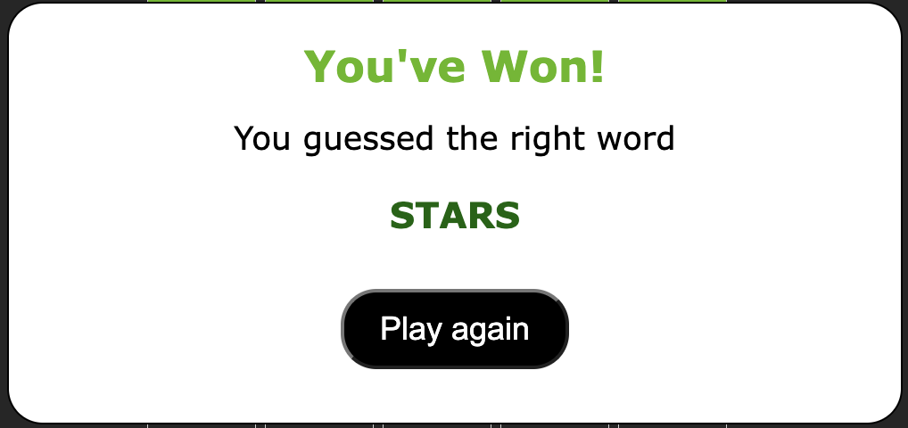

# Wordle Game

Welcome to Wordle, this is my clone of the popular New York Times game of the same name.

## Link to the game: https://antzash.github.io/Wordle/

## Description

Wordle is a game where players try to guess a secret word within a limited number of attempts. Each attempt is a guess of a five-letter word. The game provides feedback on each guess to help the player deduce the correct word.

## Features

- Guess a five-letter word to match the secret word.
- Receive feedback on each guess:

  - Correct letters in the correct position are highlighted in GREEN
  - Correct letters in the wrong position are indicated in YELLOW
  - Incorrect letters are highlighted in DARK GREY

- Modals for winning and losing scenarios.

## Usage to host locally

1. Clone the repository to your local machine.
2. Open the `wordle.html` file in your web browser.
3. Start guessing the five-letter word to match the secret word.
4. Receive feedback after each guess.

## How to Play

- Press keys to input your guess. Use the Backspace key to delete characters.
- Press Enter to submit your guess and receive feedback.
- Ensure all 5 letters have been used in each attempt before pressing Enter
- The game ends after six attempts.

## Credits

- Developed by Anthony Hashwin

## References

Youtube Tutorials

- How to Make a Pop-Up: https://youtu.be/AF6vGYIyV8M?si=8i9PVzPzZORJsjtm and https://www.youtube.com/watch?v=MBaw_6cPmAw
- Building a Wordle Clone Basic Elements - https://www.youtube.com/watch?v=ckjRsPaWHX8&t=1851s
- Tile Animations: https://www.youtube.com/watch?v=OAEuKVvmKPk&t=335s

Other references:

- making and amending HR line - https://love2dev.com/blog/html-horizontal-line/
- Word Flipping Animation - https://stackoverflow.com/questions/74192108/wordle-letter-flipping-animation
- padding between button text and button box - https://stackoverflow.com/questions/42008246/how-to-add-space-between-text-and-a-button-without-using-br
- Centering my divs - https://forum.freecodecamp.org/t/trying-to-center-a-div-but-still-off-center/260359
- Centering Text - https://blog.hubspot.com/website/center-text-in-css#:~:text=To%20center%20text%20in%20CSS%2C%20use%20the%20text%2Dalign%20property,block%20elements%2C%20such%20as%20divs.
- Adding a line break in string - https://forum.freecodecamp.org/t/how-to-add-new-line-in-string/17763
- How to make rounded edges - https://www.w3schools.com/css/css3_borders.asp

Debugging

- StackOverflow and ChatGPT/BlackBox AI
